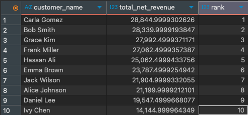
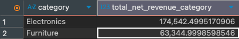
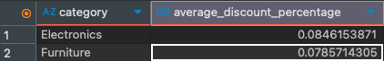
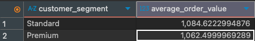
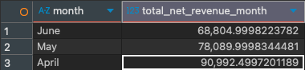
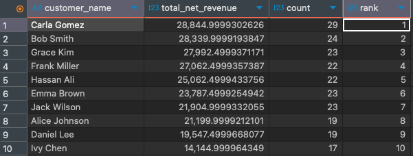

## Project Overview 

This project analyzes a fictional e-commerce transactions dataset using PostgreSQL to extract actionable business insights. The analysis focuses on customer behavior, product performance, revenue trends, discount impact, and category-level rankings.

The goal of this project is to demonstrate practical SQL skills used in real-world analytics and business intelligence roles.

## Dataset Overview

- **Source:** Synthetic e-commerce transaction dataset
- **Size:** ~250 transactions
- **Time Range:** YYYY-MM-DD to YYYY-MM-DD
- **Granularity:** One row per order-item

**Key Columns:**
- Order details: `order_id`, `order_date`, `order_status`
- Customer attributes: `customer_id`, `customer_name`, `customer_segment`
- Product attributes: `product_name`, `category`
- Financials: `quantity`, `unit_price`, `discount_pct`

## SQL Techniques Used 

- Aggregate functions (SUM, AVG, COUNT, MIN, MAX)

- Filtering and grouping (WHERE, GROUP BY, HAVING)

- Subqueries for order-level metrics

- Window functions (RANK, DENSE_RANK)

- Date functions (DATE_TRUNC)

- Business logic filtering (completed vs cancelled orders)

## Key Findings 

- Revenue is largely concentrated among a small set of customers, who contribute a disproportionate share of total revenue. This suggests that prioritizing customer retention strategies can protect a large portion of total revenue.

- Only a handful of products and categories generate the majority of revenue. This suggests that business performance depends heavily on a small subset of high-performing products rather than being spread evenly across all items.

- Discounting has a clear and measurable impact on revenue.
  - Gross revenue (pre-discount): $260,150
  - Net revenue (post-discount): $237,887.45
  - Revenue lost to discounts: $22,262.50

  - Discounts clearly affect revenue, with Electronics having a higher average discount (about 8.5%) compared to Furniture (about 7.9%). Despite this, Electronics generate significantly higher total revenue than other categories due to higher unit prices and amount of sales.

- Average order values are similar across customer segments, with Standard customers showing a slightly higher average order value than Premium customers. This suggests that while segmentation exists, spending behavior per order does not differ as much as expected between segments.

- Revenue shows noticeable variation over time, pointing to potential seasonality. Understanding time-based revenue patterns can help optimize promotional timing, and inventory decisions.

- Repeat customers represent an important source of revenue, highlighting the value of retention strategies. Investing in customer-retention strategies such as loyalty programs can drive long-term revenue growth.

## Business Recommendations

Based on the analysis, the following actions could improve business performance:

- Focus retention efforts on high-value and repeat customers to stabilize revenue.
- Evaluate discount effectiveness by category, particularly in Electronics, to balance revenue growth and margin preservation.
- Prioritize inventory and marketing spend on top-performing products and categories.
- Analyze seasonal trends further to optimize promotional timing and inventory planning.

